  

 

### 🛠️ Languages & Tech Stack

| Domain | Technologies / Tools |
| :--- | :--- |
| **Languages** | `C++`, `C#`, `Python`, `SQL`, `Bash` |
| **Systems & Core** | `Data Structures`, `Algorithms`, `OOP`, `Operating Systems` |
| **Tools & Platforms** | `Git`, `GitHub`, `Linux (Ubuntu/Arch)`, `Visual Studio`, `CMake` |

 

### 🌐 Connect With Me

  
  &nbsp;
  

