<div align="center">

  <!-- GitHub Tema Tercihine Göre Otomatik Değişen Hero Banner -->
  <picture>
    <source media="(prefers-color-scheme: dark)" srcset="./dark.svg">
    <source media="(prefers-color-scheme: light)" srcset="./light.svg">
    
  </picture>

  <br/><br/>

  <!-- Sosyal / İstatistik Rozetleri -->
  [](https://github.com/recefeb)
  [](https://github.com/recefeb)
  [](https://linkedin.com)
  [](mailto:recefeb@gmail.com)

</div>

<br/>

### ⚡ Hakkımda

```zsh
recep@dev:~$ cat about_me.json
{
  "name": "Recep Efe Bıçakçı",
  "role": "Computer Engineering Student & Developer",
  "location": "Ankara, Turkey 🇹🇷",
  "interests": ["C++", "Algorithms & Data Structures", "System Programming", "AI Workflows"],
  "currently_learning": "Advanced C++ & High-Performance Software Systems",
  "goals": "Building impactful open-source projects & mastering modern software architecture"
}
